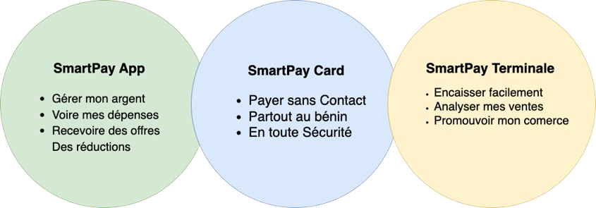
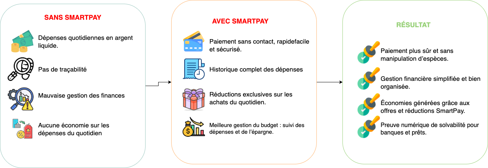
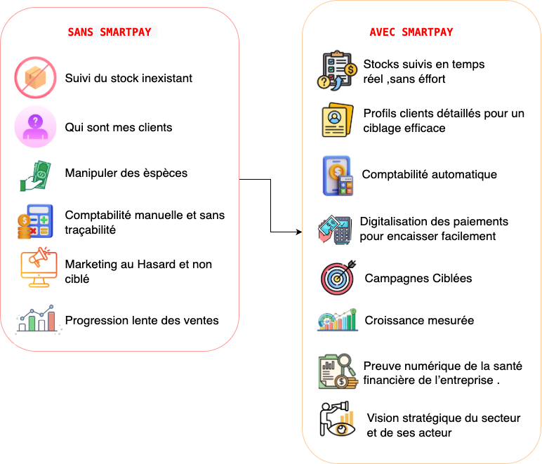
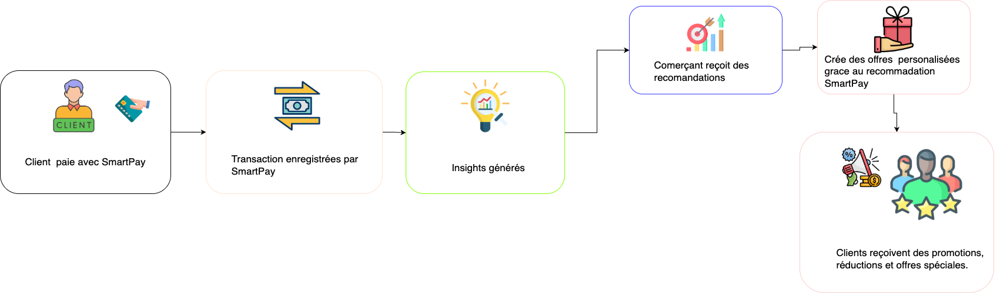
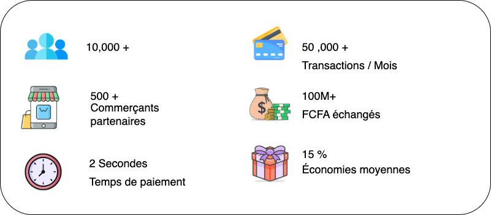
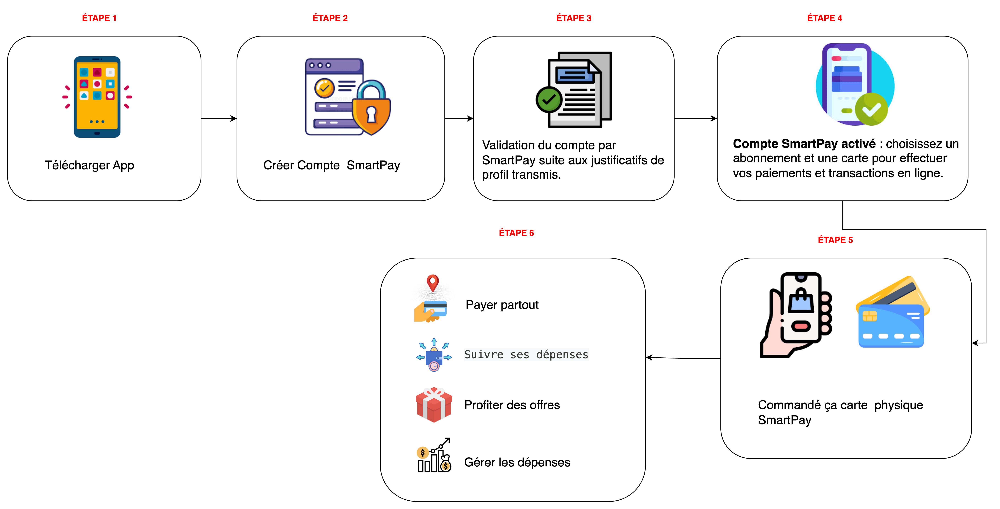
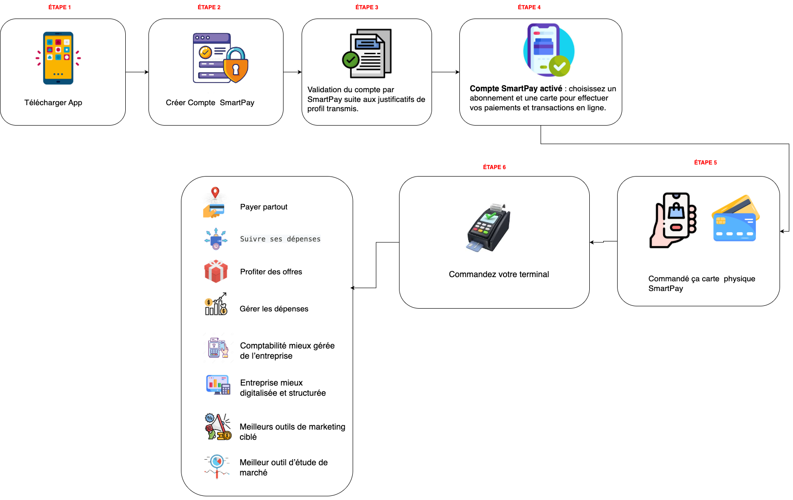
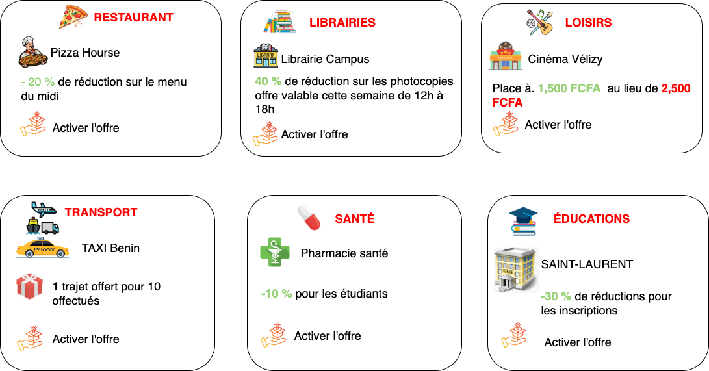

## 1. SmartPay : Les trois piliers

### Vue d’ensemble de l’écosystème SmartPay

SmartPay n’est pas un produit unique, mais un **écosystème complet** composé de trois éléments qui interagissent pour créer une expérience de paiement moderne. Chaque cercle du schéma représente un maillon essentiel de cette chaîne.

---

## Le cercle vert : L’application pour vous

Le premier cercle illustre **votre outil personnel au quotidien**.  
C’est l’interface qui vous donne le contrôle total sur vos finances depuis votre téléphone.

### Ce que vous devez comprendre :
Imaginez avoir un assistant financier dans votre poche qui :
- Vous montre instantanément combien d’argent il vous reste  
- Garde la trace de chaque franc dépensé automatiquement  
- Vous alerte quand vous dépensez trop  
- Vous propose des réductions là où vous allez souvent  

### Exemple concret :
Vous achetez votre café du matin à 500 FCFA.  
Sans SmartPay, vous sortez des pièces et oubliez cette dépense.  
Avec SmartPay, cette transaction est automatiquement enregistrée, catégorisée, et à la fin du mois, vous découvrez que vous avez dépensé 15 000 FCFA en café. Vous pouvez alors décider de réduire ou non.

---

## Le cercle bleu : La carte pour payer

Le deuxième cercle représente **votre moyen de paiement physique**.  
C’est l’objet que vous portez dans votre portefeuille et que vous utilisez au quotidien.

### Ce que vous devez comprendre :
Pensez à cette carte comme une version améliorée de l’argent liquide :
- Elle contient votre argent en toute sécurité  
- Elle fonctionne d’un simple geste (approche et c’est payé)  
- Elle est acceptée partout où vous voyez le logo SmartPay  
- Si vous la perdez, vous la bloquez depuis votre téléphone  

### Exemple concret :
Vous entrez dans une boutique, prenez ce dont vous avez besoin, approchez votre carte du lecteur pendant 2 secondes, un bip confirme le paiement, et vous partez.  
Pas besoin de chercher de la monnaie ni de reçu : tout est visible dans l’application.

---

## Le cercle jaune : L’outil pour les commerçants

Le troisième cercle montre **la solution pour ceux qui vendent**.  
C’est ce qui permet aux boutiques, restaurants et autres commerces d’accepter vos paiements et de faire croître leur activité.

### Ce que vous devez comprendre :
Le terminal est bien plus qu’une machine à encaisser, c’est un véritable assistant commercial qui :
- Accepte les paiements rapidement sans manipuler d’espèces  
- Révèle au commerçant ce qui marche et ce qui ne marche pas  
- L’aide à attirer plus de clients avec des promotions ciblées  
- Lui donne les informations dont il a besoin pour réussir  

---

## Comment comprendre l’écosystème SmartPay

Les trois cercles ne sont pas isolés, ils forment un **triangle d’interactions** :

### Le lien entre VOUS et VOTRE CARTE (vert ↔ bleu)
Votre application et votre carte sont synchronisées en permanence.  
Quand vous payez avec la carte, l’application enregistre automatiquement la transaction.  
Quand vous rechargez depuis l’application, l’argent est immédiatement disponible sur votre carte.

**En pratique :**  
Vous êtes au marché sans votre téléphone. Vous payez avec votre carte.  
En rentrant chez vous, vous ouvrez l’application et toutes vos dépenses du marché sont déjà là, classées et analysées.

### Le lien entre VOTRE CARTE et LE COMMERÇANT (bleu ↔ jaune)
C’est le moment de la transaction. Votre carte communique avec le terminal du commerçant pour transférer l’argent de manière sécurisée et instantanée.

**En pratique :**  
Vous approchez votre carte du terminal du commerçant. En 2 secondes, trois choses se passent :  
l’argent quitte votre compte, arrive sur le compte du commerçant, et vous recevez tous les deux une confirmation.

### Le lien entre VOUS et LE COMMERÇANT (vert ↔ jaune)
C’est là que la magie opère.  
Grâce aux données collectées, le commerçant peut vous envoyer des offres personnalisées directement sur votre application, et vous pouvez les activer d’un simple clic.

---

## Pourquoi trois composantes et pas une seule ?

Vous pourriez vous demander : « Pourquoi ne pas tout mettre dans une seule application ? »

**La réponse est simple :** chaque élément a un rôle spécifique et un public différent.

**La carte (bleu)** doit être :
- Physique pour payer même sans téléphone  
- Rapide pour les transactions quotidiennes  
- Universelle pour fonctionner partout  

**L’application (vert)** doit être :
- Complète pour gérer toutes les fonctionnalités  
- Personnalisée selon votre profil  
- Évolutive avec de nouvelles fonctionnalités  

**Le terminal (jaune)** doit être :
- Professionnel pour les commerçants  
- Robuste pour un usage intensif  
- Analytique pour aider à la croissance  

Ensemble, ces trois éléments créent une expérience fluide où chacun utilise l’outil adapté à son besoin du moment.

---

## 2. Comment ça marche : Une journée avec SmartPay

### Scénario 1 : Marie, étudiante

---

## 3. Les avantages SmartPay en images

### Pour les utilisateurs

### Pour les commerçants

---

## 4. Le cercle vertueux SmartPay

**Comment tout le monde en profite**  
Chaque transaction alimente un écosystème où utilisateurs, commerçants et SmartPay gagnent ensemble.

---

## 5. Projection SmartPay en chiffres

**L’impact au quotidien**  
Des milliers d’utilisateurs bénéficient déjà d’une meilleure gestion financière et de paiements simplifiés.

---

## 6. Le réseau SmartPay : carte de présence

### Où utiliser SmartPay au Bénin
Disponible dans les principales villes : **Cotonou, Calavi, Porto-Novo**, et bientôt sur tout le territoire.

---

## 7. Le parcours utilisateur

### 7.1 Le parcours orienté commerçant

---

## 8. L’écosystème familial SmartPay

**Comment une famille utilise SmartPay**  
Les parents rechargent les cartes des enfants, suivent leurs dépenses, et tout se synchronise automatiquement.

---

## 9. Les types d’offres disponibles

### Exemples de promotions SmartPay
Des réductions exclusives, des bonus de fidélité et des programmes de parrainage.

---

## 10. Résumé visuel : SmartPay en un clin d’œil

Cette section permet de **comprendre visuellement SmartPay** sans entrer dans les détails techniques — parfaite pour une introduction accessible à tous.